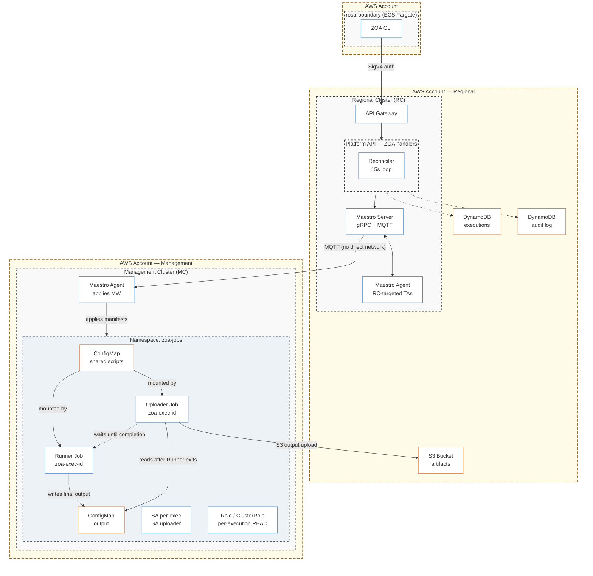

# ROSA Hyperfleet ZOA

Zero Operator Access (ZOA) — CLI and tooling for the ROSA HCP Hyperfleet platform.

## Overview

ZOA is the security and operational access layer for the ROSA HCP Hyperfleet platform. It ensures that operators have **no persistent, interactive, or unaudited access** to customer infrastructure, control planes, or data. Instead, all operational actions are executed through pre-defined, audited **Trusted Actions (TAs)** via the Platform API.

This repository contains:

- **`zoa` CLI** (`cmd/zoa/`) — Go CLI for executing Trusted Actions against target clusters
- **`zoa-tools` image** (`Containerfile` + `image/`) — Container image (kubectl + aws-cli) with runner/uploader entrypoints used by TA Jobs on target clusters
- **Trusted Actions** (`trusted-actions/`) — Action definitions (scripts, RBAC, params); consumed by the platform repo at a pinned commit/hash

## Architecture



## Key Properties

- **Zero standing access** — operators never get kubectl, kubeconfig, or direct cluster access; all interaction happens through the audited API
- **Per-execution RBAC** — each dispatch creates its own ServiceAccount + Role scoped to exactly what the TA declares, destroyed on completion
- **Two-job privilege separation** — runner container has K8s access only, uploader container has S3 access only; no single credential can both read cluster state and exfiltrate data
- **Immutable audit trail** — every action is logged with caller identity (AWS ARN), target cluster, action, jira ticket, approval state, and duration; 365-day retention
- **HCP secrets protection** — API-level policy rejects any TA requesting secrets in customer namespaces (`clusters-*`), regardless of template content
- **Write cooldown** — write actions are rate-limited per target cluster to prevent accidental cascading changes; bypassable with `force=true` for emergencies
- **Three-layer timeout model** — if a TA exceeds its time budget, the reconciler marks it timed-out and deletes the resources (Layer 1); if the reconciler is down, `activeDeadlineSeconds` force-kills the Job via Kubernetes (Layer 2); once finished, `ttlSecondsAfterFinished` garbage-collects Job objects (Layer 3). No execution can leave dangling resources regardless of failure mode
- **FedRAMP-ready** — KMS encryption at rest (DynamoDB + S3), bucket policy enforcement rejecting non-CMK uploads, PITR with 35-day continuous backups, deletion protection

## Documentation

- [ZOA Architecture](https://github.com/openshift-online/rosa-hyperfleet/blob/main/docs/design/zoa-architecture.md) — system overview, execution flow, component interactions
- [ZOA Security Model](https://github.com/openshift-online/rosa-hyperfleet/blob/main/docs/design/zoa-security-model.md) — threat model, privilege separation, HCP protection
- [ZOA Trusted Actions Specification](https://github.com/openshift-online/rosa-hyperfleet/blob/main/docs/design/zoa-trusted-actions.md) — TA authoring guide, scope/type system
- [ZOA API Reference](https://github.com/openshift-online/rosa-hyperfleet-api/blob/main/docs/api/zoa-endpoints.md) — REST API endpoints, schemas, and examples

## Related Repositories

| Repository | What it contains |
|---|---|
| [rosa-hyperfleet](https://github.com/openshift-online/rosa-hyperfleet) | Terraform infra (DynamoDB, S3, KMS, IAM), Helm charts, TA templates, ArgoCD deployment |
| [rosa-hyperfleet-api](https://github.com/openshift-online/rosa-hyperfleet-api) | Execution engine, REST API handlers, reconciler, DynamoDB stores |

## Repository Structure

```
rosa-hyperfleet-zoa/
├── cmd/zoa/                CLI entry point
├── internal/
│   ├── cli/                Cobra commands (run, get, runs, actions, describe, audit, logs)
│   ├── client/             Platform API client (SigV4-signed HTTP)
│   ├── output/             Formatting (table, JSON)
│   └── version/            Version info (injected via ldflags)
├── trusted-actions/        Trusted Action definitions (YAML + scripts)
├── image/                  Runner/uploader entrypoints for zoa-tools container
├── ci/                     CI scripts and build-root Containerfile
├── .github/
│   ├── dependabot.yml      Automated dependency updates
│   └── workflows/          GitHub Actions (release)
├── Containerfile           zoa-tools multi-arch image (UBI9 Minimal)
├── .golangci.yml           Linter config (v2 format, std-error-handling preset)
├── Makefile                Build, test, lint, image targets
├── go.mod / go.sum         Go module dependencies
└── CLAUDE.md               AI agent guidance
```

## CLI Reference

### Subcommands

| Command | Description |
|---------|-------------|
| `run <action>` | Execute a Trusted Action against a target cluster |
| `runs` | List recent executions with filters |
| `get <exec-id>` | Get execution details, output, and logs |
| `logs <exec-id>` | Show raw execution log (from S3) |
| `actions` | List all available Trusted Actions |
| `describe <action>` | Show Trusted Action details (params, scope, approval) |
| `audit` | View audit log of API calls |
| `completion` | Generate shell completion scripts (bash, zsh, fish) |
| `version` | Print version information |

### Quick Examples

```bash
# Discover available actions
zoa actions
zoa describe get_pods

# Execute a read action
zoa run get_nodes -t mc-useast1-1 --jira ROSAENG-1234

# Namespaced with label selector
zoa run get_pods -t mc-useast1-1 -n cert-manager -l app=cert-manager --jira ROSAENG-1234

# Verbose JSON output (piped to jq)
zoa run get_pods -t mc-useast1-1 -A -v --jira ROSAENG-1234 | jq '.[] | select(.status != "Running")'

# Write action with dry-run
zoa run rollout_restart -t mc-useast1-1 -n cert-manager --name cert-manager-webhook --jira ROSAENG-1234 --dry-run

# View execution history
zoa runs --status failed --since 24h
zoa runs --type write --since 12h

# Audit log
zoa audit --method POST --since 1h
zoa audit -o json | jq '.items[] | select(.status_code >= 400)'

# Get execution output
zoa get <exec-id> --include-all
zoa logs <exec-id>
```

### Global Flags

```
--api-url string   Platform API Gateway URL (env: API_URL)
-o, --output string    Output format: table, json (default "table")
-h, --help             Help for any command
```

### `run` Flags

| Flag | Short | Description |
|------|-------|-------------|
| `--target` | `-t` | Target cluster (required) |
| `--namespace` | `-n` | Namespace |
| `--all-namespaces` | `-A` | All namespaces |
| `--selector` | `-l` | Label selector |
| `--verbose` | `-v` | Full JSON output from the action |
| `--name` | | Resource name |
| `--resource` | | Resource type (for generic actions) |
| `--jira` | | Jira ticket (required) |
| `--force` | | Bypass write cooldown and concurrency limits |
| `--dry-run` | | Execute dry-run variant of the action |
| `--no-wait` | | Don't wait for completion |
| `--param` | | Additional parameters (key=value, repeatable) |

### `runs` Filters

All filters are combinable: `--target`, `--status`, `--action`, `--operator`, `--scope`, `--type`, `--output-status`, `--approval`, `--dry-run`, `--force`, `--since`, `--limit`.

### `audit` Filters

`--target`, `--action`, `--operator`, `--method`, `--approval`, `--since`, `--limit`.

### Shell Completion

```bash
# zsh (current session)
source <(zoa completion zsh)

# bash
source <(zoa completion bash)

# fish
zoa completion fish | source
```

## Development

### Prerequisites

- **Go 1.25+** — install from [go.dev/dl](https://go.dev/dl/) or via GVM
- **golangci-lint v2.12+** — `go install github.com/golangci/golangci-lint/v2/cmd/golangci-lint@v2.12.2`
- **Make**
- **AWS CLI v2** — with a profile configured for your environment

### Quick Start

```bash
git clone https://github.com/openshift-online/rosa-hyperfleet-zoa.git
cd rosa-hyperfleet-zoa
make all                    # fmt → vet → lint → test → build

# Load AWS credentials for your environment
eval "$(aws configure export-credentials --format env --profile <your-profile>)"

# Set the API Gateway URL for your region
export API_URL=https://<id>.execute-api.<region>.amazonaws.com/prod

./bin/zoa actions           # Verify connectivity
```

### Build Targets

| Target | What it does |
|--------|-------------|
| `make all` | fmt → vet → lint → test → build (run before pushing) |
| `make build` | Build `./bin/zoa` |
| `make install` | Install to `$GOBIN` |
| `make fmt` | Format code (`gofmt -w -s`) |
| `make vet` | Static analysis (`go vet`) |
| `make lint` | Lint (`golangci-lint`) |
| `make test` | Unit tests with coverage |
| `make verify` | Read-only checks (`fmt-check + vet + lint`) |
| `make tidy` | Clean up `go.mod` / `go.sum` |

### CI

CI runs via [OpenShift CI (Prow)](https://prow.ci.openshift.org/) with config in [openshift/release](https://github.com/openshift/release/tree/main/ci-operator/config/openshift-online/rosa-hyperfleet-zoa).

Jobs triggered on every PR:

| Job | Script | What it checks |
|-----|--------|----------------|
| `lint` | `ci/lint.sh` | `make fmt-check` + `make lint` |
| `test` | `ci/unit-tests.sh` | `make test` + coverage artifacts |
| `verify` | `ci/verify.sh` | `make verify` |

### Commit Conventions

Use [conventional commits](https://www.conventionalcommits.org/):

```
feat: add new trusted action command
fix: handle timeout in dispatch request
docs: update development guide
chore: bump golangci-lint to v2.13.0
```

### Releasing

The CLI version is defined in the `VERSION` variable at the top of the `Makefile`.
On merge to `main`, a GitHub Action checks if the version is new and creates a git tag + GitHub Release automatically.

**Steps to release a new version:**

1. Bump `VERSION` in `Makefile` (e.g., `VERSION = 0.2.0`)
2. Open a PR with your changes (including the version bump)
3. On merge, the `Release CLI` workflow creates tag `v0.2.0` and a GitHub Release

The version is injected into the binary at build time via `-ldflags`, so `zoa version` prints the Makefile `VERSION`.

### GVM Users

If using GVM and `make test` fails with `go: no such tool "covdata"`, fix with:

```bash
chmod u+w $(go env GOROOT)/pkg/tool/linux_amd64/
GOWORK=off go build -o $(go env GOROOT)/pkg/tool/linux_amd64/covdata cmd/covdata
```

## Container Image

The `zoa-tools` image is a FIPS-compliant toolbox based on UBI9 Minimal, containing:

- **kubectl / oc** — Red Hat FIPS-compliant BoringCrypto build (stable-4.21)
- **AWS CLI v2** — FIPS endpoints enabled at runtime via `AWS_USE_FIPS_ENDPOINT=true`
- **jq / yq** — JSON and YAML processing
- **Entrypoints** — `image/entrypoint.sh` (runner) and `image/upload_entrypoint.sh` (uploader) baked at `/zoa/`
- **Multi-arch** — supports both `amd64` and `arm64` (Graviton-ready)
- **Non-root** — runs as UID 1001 (OpenShift-compatible)

```bash
make image          # Build multi-arch image (amd64 + arm64)
make image-push     # Build and push manifest list
```

Override defaults:

```bash
IMAGE_REPO=quay.io/myorg/zoa-tools IMAGE_TAG=v1.0.0 make image-push
```

