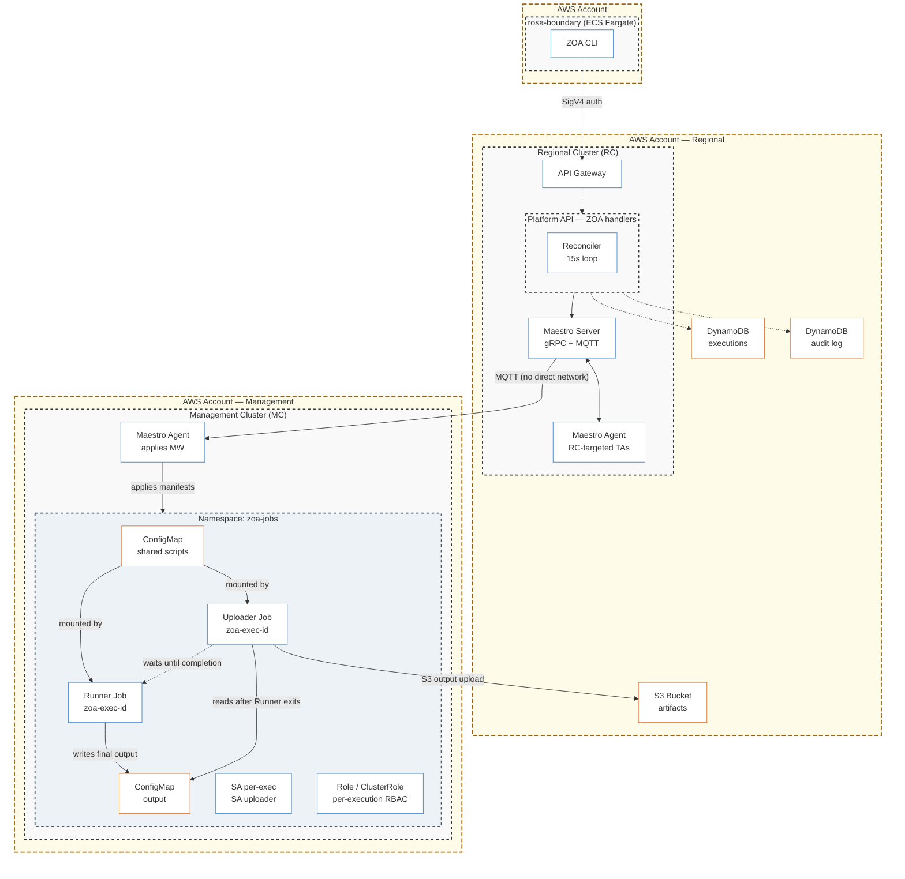

# ROSA Hyperfleet ZOA

Zero Operator Access (ZOA) — CLI and tooling for the ROSA HCP Hyperfleet platform.

## Overview

ZOA is the security and operational access layer for the ROSA HCP Hyperfleet platform. It ensures that operators have **no persistent, interactive, or unaudited access** to customer infrastructure, control planes, or data. Instead, all operational actions are executed through pre-defined, audited **Trusted Actions (TAs)** via the Platform API.

This repository contains:

- **`zoa` CLI** (`cmd/zoa/`) — Go CLI for executing Trusted Actions against target clusters
- **`zoa-tools` image** (`Containerfile` + `image/`) — Container image (kubectl + aws-cli) with runner/uploader entrypoints used by TA Jobs on target clusters
- **Trusted Actions** (`trusted-actions/`) — Action definitions (scripts, RBAC, params); consumed by the platform repo at a pinned commit/hash

## Architecture



### Documentation

- [ZOA Architecture](https://github.com/openshift-online/rosa-hyperfleet/blob/main/docs/design/zoa-architecture.md) — system overview, execution flow, component interactions
- [ZOA Security Model](https://github.com/openshift-online/rosa-hyperfleet/blob/main/docs/design/zoa-security-model.md) — threat model, privilege separation, HCP protection
- [ZOA Trusted Actions Specification](https://github.com/openshift-online/rosa-hyperfleet/blob/main/docs/design/zoa-trusted-actions.md) — TA authoring guide, scope/type system
- [ZOA API Reference](https://github.com/openshift-online/rosa-hyperfleet-api/blob/main/docs/api/zoa-endpoints.md) — REST API endpoints, schemas, and examples

## Key Properties

- **Zero standing access** — operators never get kubectl, kubeconfig, or direct cluster access; all interaction happens through the audited API
- **Per-execution RBAC** — each dispatch creates its own ServiceAccount + Role scoped to exactly what the TA declares, destroyed on completion
- **Two-job privilege separation** — runner container has K8s access only, uploader container has S3 access only; no single credential can both read cluster state and exfiltrate data
- **Immutable audit trail** — every action is logged with caller identity (AWS ARN), target cluster, action, jira ticket, approval state, and duration; 365-day retention
- **HCP secrets protection** — API-level policy rejects any TA requesting secrets in customer namespaces (`clusters-*`), regardless of template content
- **Write cooldown** — write actions are rate-limited per target cluster to prevent accidental cascading changes; bypassable with `force=true` for emergencies
- **Three-layer timeout model** — if a TA exceeds its time budget, the reconciler marks it timed-out and deletes the resources (Layer 1); if the reconciler is down, `activeDeadlineSeconds` force-kills the Job via Kubernetes (Layer 2); once finished, `ttlSecondsAfterFinished` garbage-collects Job objects (Layer 3). No execution can leave dangling resources regardless of failure mode
- **FedRAMP-ready** — KMS encryption at rest (DynamoDB + S3), bucket policy enforcement rejecting non-CMK uploads, PITR with 35-day continuous backups, deletion protection

## Container Image

The `zoa-tools` image is a FIPS-compliant toolbox based on UBI9 Minimal, containing:

- **kubectl / oc** — Red Hat FIPS-compliant BoringCrypto build (stable-4.21)
- **AWS CLI v2** — FIPS endpoints enabled at runtime via `AWS_USE_FIPS_ENDPOINT=true`
- **jq / yq** — JSON and YAML processing
- **Entrypoints** — `image/entrypoint.sh` (runner) and `image/upload_entrypoint.sh` (uploader) baked at `/zoa/`
- **Multi-arch** — supports both `amd64` and `arm64` (Graviton-ready)
- **Non-root** — runs as UID 1001 (OpenShift-compatible)

```bash
make image          # Build multi-arch image (amd64 + arm64)
make image-push     # Build multi-arch and push manifest list
```

Override defaults:

```bash
IMAGE_REPO=quay.io/myorg/zoa-tools IMAGE_TAG=v1.0.0 make image-push
```

## Development

```bash
make build-cli      # Build ./bin/zoa
make test           # Unit tests (go test -race)
make fmt            # Format Go code
make lint           # Lint (golangci-lint or go vet)
make verify         # All checks: fmt + lint + test
make help           # Show all targets
```

## Related Repositories

| Repository | What it contains |
|---|---|
| [rosa-hyperfleet](https://github.com/openshift-online/rosa-hyperfleet) | Terraform infra (DynamoDB, S3, KMS, IAM), Helm charts, TA templates, ArgoCD deployment |
| [rosa-hyperfleet-api](https://github.com/openshift-online/rosa-hyperfleet-api) | Execution engine, REST API handlers, reconciler, DynamoDB stores |
