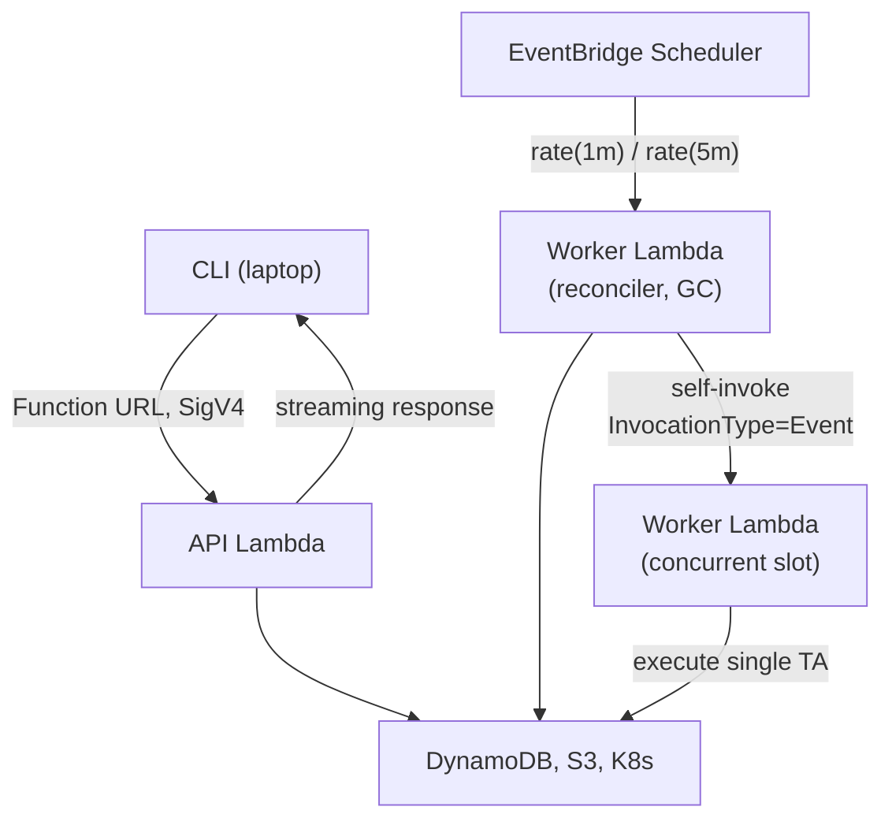

# ZOA Lambda Model

## Overview

ZOA deploys **multiple Lambda functions per VPC** (one set per cluster: RC + each MC):

| Lambda | Trigger | Purpose |
|---|---|---|
| **API** | Function URL (IAM auth) | CLI requests, sync TAs, streaming downloads |
| **Worker** | EventBridge + self-invoke | Reconciler, GC, async TA execution |
| **Access** · PLANNED | API Gateway (public) | rosa-boundary session management, approvals |

API and Worker use the **same binary** (`zoa-lambda`), differentiated by the `HANDLER_MODE` environment variable. Access will be a separate binary.

## Why Separate Functions

Each Lambda has different operational characteristics that are per-function AWS settings:

| Setting | API | Worker | Access (PLANNED) |
|---------|-----|--------|-------------------|
| Invocation | Function URL (streaming) | EventBridge + self-invoke | API Gateway |
| VPC | Yes (EKS access) | Yes (EKS access) | No (no cluster access) |
| Throttle behavior | HTTP 429 to caller | AWS queues + retries (up to 6h) | HTTP 429 to caller |

These cannot share a single function because timeout, concurrency, invocation mode (streaming vs standard handler), and VPC attachment are per-function settings.

Timeout and concurrency values are configured in Terraform (`terraform/modules/zoa-lambda/variables.tf`).

## Event Routing

The Worker Lambda uses the `route` field in the event payload:

```json
{"route": "reconciler"}
{"route": "gc"}
{"route": "execute", "execution_id": "abc123"}
```

## Self-Invocation Pattern

When the reconciler dispatches an approved TA:

1. Reconciler queries DynamoDB for `status=approved` executions
2. Atomically transitions each to `status=dispatched` (conditional write)
3. Invokes itself with `InvocationType=Event` (async, fire-and-forget):
   ```go
   lambdaClient.Invoke(ctx, &lambda.InvokeInput{
       FunctionName:   aws.String(os.Getenv("AWS_LAMBDA_FUNCTION_NAME")),
       InvocationType: lambdatypes.InvocationTypeEvent,
       Payload:        []byte(`{"route":"execute","execution_id":"abc123"}`),
   })
   ```
4. AWS Lambda queues the invocation and executes it in a separate concurrent slot

### Concurrency Model

Each Lambda has its own `reserved_concurrent_executions` pool (configured in Terraform via `lambda_api_concurrency` and `lambda_worker_concurrency`):

- **API Lambda** — each concurrent CLI request uses one slot. Under saturation, excess requests get throttled (429).
- **Worker Lambda** — 1 slot is consumed by the scheduled reconciler/GC tick, the rest are available for self-invoked TA executions. Excess invocations queue in Lambda's internal retry queue (up to 6 hours).

Reserved concurrency guarantees slots are always available (not stolen by other functions in the account) and caps cost by limiting fan-out.

See `terraform/modules/zoa-lambda/variables.tf` for current values.

## Code-Level Deadlines

Each route gets a `context.WithTimeout` enforced in code:

| Route | Deadline | Why |
|---|---|---|
| `reconciler` | 55s | Must finish quickly; runs every 60s |
| `gc` | 55s | Cleanup can be deferred; runs every 5min |
| `execute` | 295s | TA execution; bounded by Lambda timeout |

All values are **env-var tunable** without code redeployment.

## Batch Limits

Each scheduled phase processes at most `MAX_BATCH_PER_TICK` items (default 30). If:
- The batch limit is reached, or
- `ctx.Err() != nil` (deadline approaching)

...remaining items are deferred to the next tick. This prevents timeout under load.

## Data Flow



## Cross-Account Access (MC Lambdas)

MC Lambdas access RC data layer (DynamoDB, S3, KMS) via resource-based policies:
- DynamoDB: `aws_dynamodb_resource_policy` allowing the MC Lambda role
- S3: Bucket policy with `AllowCrossAccountLambdaAccess`
- KMS: Key policy with `AllowCrossAccountLambdaKMS`

No STS AssumeRole needed for data access — policies are on the resources themselves.

## Design Decisions

| Decision | Rationale |
|---|---|
| Self-invoke over SQS | Simpler (no queue config), automatic retries, Lambda handles backpressure |
| Reserved concurrency | Prevents noisy-neighbor issues; caps cost |
| 300s Lambda timeout | Gives 295s for code; handles slow TAs without hitting AWS 900s limit |
| Same binary | Zero divergence; route by env var + event payload |
| EMF metrics | CW Exporter already scrapes CloudWatch; EMF is zero-config |
| SQS DLQ | Catch failures from EventBridge and self-invocations |
